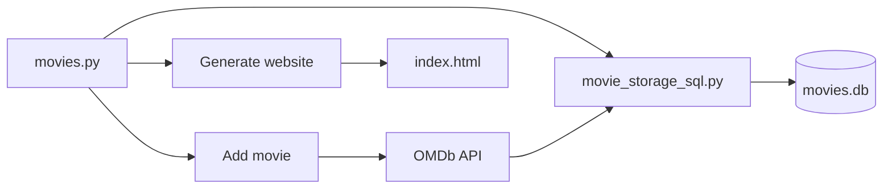

# My Movie App

A Python command-line app for managing a personal movie collection. Movies are stored in a local SQLite database; when you add a title, metadata (year, IMDb rating, poster) is fetched from the [OMDb API](http://www.omdbapi.com/). You can also export the collection as a static HTML page.

## Features

- **Add movies** — look up a title via OMDb and save it to the database
- **List & sort** — view all movies, or sort by rating
- **Search** — find movies by partial title match
- **Update & delete** — change a rating (0.0–10.0) or remove a movie
- **Stats** — average, median, best- and worst-rated titles
- **Random pick** — suggest a random movie from the collection
- **Generate website** — build a static gallery at `_static/index.html`

## Tech stack

- Python 3.14
- SQLite + SQLAlchemy
- requests + python-dotenv (OMDb API)
- pytest

## Getting started

### Prerequisites

- Python 3.14+
- An [OMDb API key](https://www.omdbapi.com/apikey.aspx) (free tier available)

### Installation

```bash
git clone git@github.com:ANY1-hub/my_movie_app.git
cd my_movie_app
python -m venv .venv
```

Activate the virtual environment:

```powershell
# Windows PowerShell
.venv\Scripts\Activate.ps1
```

```bash
# Windows Git Bash / macOS / Linux
source .venv/Scripts/activate   # or: source .venv/bin/activate
```

```bash
pip install -r requirements.txt
```

Create a `.env` file in the project root (gitignored):

```
OMDB_API_KEY=your_api_key_here
```

### Run the app

```bash
python app.py
```

| # | Action |
|---|--------|
| 0 | Exit |
| 1 | List movies |
| 2 | Add movie |
| 3 | Delete movie |
| 4 | Update movie rating |
| 5 | Stats |
| 6 | Random movie |
| 7 | Search movie |
| 8 | Movies sorted by rating |
| 9 | Generate website |

Open `_static/index.html` in a browser after using **Generate website**.

### Run tests

```bash
pytest
```

## Project structure

```
my_movie_app/
├── movies.py                 # CLI entry point and menu
├── movie_storage_sql.py      # SQLite CRUD (SQLAlchemy)
├── fetching_movies_data.py   # OMDb API client
├── helpers.py                # Stats and HTML generation
├── colors.py                 # Terminal color constants
├── _static/
│   ├── index_template.html
│   ├── index.html            # Generated output
│   └── style.css
├── movies.db                 # SQLite database
├── requirements.txt
├── test_movies.py
└── test_movie_storage_sql.py
```

## How it works



- **`movie_storage_sql.py`** — creates the `movies` table and handles list/add/update/delete via SQLAlchemy
- **`fetching_movies_data.py`** — calls OMDb by title; reads `OMDB_API_KEY` from `.env`
- **`helpers.py`** — statistics, title matching, and HTML serialization for the static export

## Dependencies

See [`requirements.txt`](requirements.txt) for pinned versions:

| Package | Role |
|---------|------|
| SQLAlchemy | Database access |
| requests | HTTP client for OMDb |
| python-dotenv | Load API key from `.env` |


===============================================

===============================================  
## Further improvements TODO:  
Bonus - User Profiles  
Why Add User Profiles?  
So far, all movies are stored in one big list, meaning everyone shares the same movie database.
But what if multiple users want to use our app and John, Sara, and Jack all have different tastes? What if Sara wants a separate list from Jack’s?  
💡 By adding user profiles, each user gets their own personalized movie library!  
### How Will It Work?  
 - When starting the app, the user will select a profile (or create a new one).
 - Each user’s movies are separate from other users’ movies.
 - When listing movies, only the movies from the selected user are displayed.
 - When generating the website we can save it as e.g. “John.html”
### Example in the Terminal
Let’s say the app starts, and Sara logs in:

Welcome to the Movie App! 🎬

Select a user:
1. John
2. Sara
3. Jack
4. Create new user

Enter choice: 2
Now, when Sara adds a movie, it’s stored in her personal movie list.

Enter new movie name: Titanic

✅ Movie 'Titanic' added to Sara's collection!
When John logs in, he won’t see Sara’s movies:

Welcome back, John! 🎬

1. List movies
2. Add movie
3. Delete movie
4. Update movie
5. Switch user

Enter choice: 1

📢 John, your movie collection is empty. Add some movies!  
### Hints on How This Works
#### How does the app know which user is logged in?
 - The app keeps track of the active user (maybe storing their name in a variable).
 - Before listing, adding, or updating movies, the app checks which user is active.
#### How are movies stored separately?
 - Each movie is linked to a specific user.
 - This means we also need a user table.
 - The movies table keeps a foreign key user_ID for each movie, so the app only fetches movies for the logged-in user.

#### How do users switch profiles?
 - The app shows a list of users and lets them pick one.
 - It then updates the active user so all future actions apply only to their movie collection.
### Why This is Cool
 - Users don’t see each other’s movies.
 - Each user has a customized movie list.
 - Makes the app feel personalized and user-friendly.


## Bonus - Update Notes Feature
Bonus Step
This is a bonus step, you can skip it if you want.
Specification
Implement the update feature so it adds notes to a movie.
When a users click on the “update” command in the menu, they are prompted with a movie name, followed by a note:

Menu:
...
4. Update movie
...

Enter choice (0-9): 4

Enter movie name: Titanic
Enter movie note: My favorite movie!
Movie Titanic successfully updated
The command adds a note to the movie in the database.
The note should be displayed also in the website. When the users hover (with the mouse) the movie poster, the note should be displayed, in any way that you want.
For example:
.guides/img/titanic_notes


## Bonus - Rating
Bonus Step
This is a bonus step, you can skip it if you want.
Specification
Right now the rating is not displayed. Add the rating for each movie, it can be displayed in any way you want in the website.


## Bonus - IMDB Link
Bonus Step
This is a bonus step, you can skip it if you want.
Specification
When the users click on the movie’s poster, they are transferred to the movie’s page in IMDB.


## Bonus - Many Movies
Bonus Step
This is a bonus step, you can skip it if you want.
Specification
What happens when you add 20 movies to your application? The website does not look good.
Change the CSS/HTML of the website so it displays it in a pleasant format.


## Bonus - Country's Flag
Bonus Step
This is a bonus step, you can skip it if you want.
Specification
Next to each movies, display a little flag that indicates the origin country of the movie.
Hint
Use another API to get an emoji/image of the correct flag.

## Bonus - Choose Your Own Feature
Bonus Step
This is a bonus step, you can skip it if you want.
Specification
Explore new features, be wild! Add something close to your heart to your application.
It can be an improvement of the styling, communication with another API, improved CLI menu and many more.