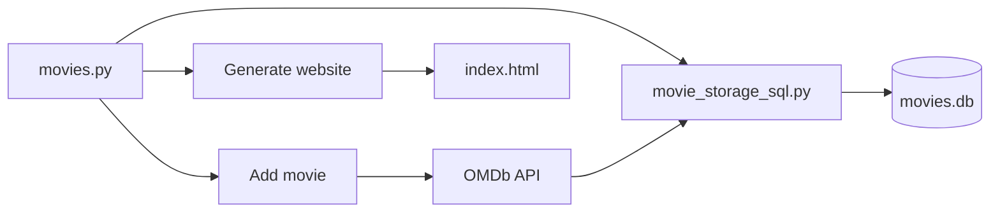

# My Movie App

A Python command-line app for managing a personal movie collection. Movies are stored in a local SQLite database; when you add a title, metadata (year, IMDb rating, poster) is fetched from the [OMDb API](http://www.omdbapi.com/). You can also export the collection as a static HTML page.

## Features

- **Add movies** — look up a title via OMDb and save it to the database
- **List & sort** — view all movies, or sort by rating
- **Search** — find movies by partial title match
- **Update & delete** — change a rating (0.0–10.0) or remove a movie
- **Stats** — average, median, best- and worst-rated titles
- **Random pick** — suggest a random movie from the collection
- **Generate website** — build a static gallery at `_static/index.html`

## Tech stack

- Python 3.14
- SQLite + SQLAlchemy
- requests + python-dotenv (OMDb API)
- pytest

## Getting started

### Prerequisites

- Python 3.14+
- An [OMDb API key](https://www.omdbapi.com/apikey.aspx) (free tier available)

### Installation

```bash
git clone git@github.com:ANY1-hub/my_movie_app.git
cd my_movie_app
python -m venv .venv
```

Activate the virtual environment:

```powershell
# Windows PowerShell
.venv\Scripts\Activate.ps1
```

```bash
# Windows Git Bash / macOS / Linux
source .venv/Scripts/activate   # or: source .venv/bin/activate
```

```bash
pip install -r requirements.txt
```

Create a `.env` file in the project root (gitignored):

```
OMDB_API_KEY=your_api_key_here
```

### Run the app

```bash
python app.py
```

| # | Action |
|---|--------|
| 0 | Exit |
| 1 | List movies |
| 2 | Add movie |
| 3 | Delete movie |
| 4 | Update movie rating |
| 5 | Stats |
| 6 | Random movie |
| 7 | Search movie |
| 8 | Movies sorted by rating |
| 9 | Generate website |

Open `_static/index.html` in a browser after using **Generate website**.

### Run tests

```bash
pytest
```

## Project structure

```
my_movie_app/
├── movies.py                 # CLI entry point and menu
├── movie_storage_sql.py      # SQLite CRUD (SQLAlchemy)
├── fetching_movies_data.py   # OMDb API client
├── helpers.py                # Stats and HTML generation
├── colors.py                 # Terminal color constants
├── _static/
│   ├── index_template.html
│   ├── index.html            # Generated output
│   └── style.css
├── movies.db                 # SQLite database
├── requirements.txt
├── test_movies.py
└── test_movie_storage_sql.py
```

## How it works



- **`movie_storage_sql.py`** — creates the `movies` table and handles list/add/update/delete via SQLAlchemy
- **`fetching_movies_data.py`** — calls OMDb by title; reads `OMDB_API_KEY` from `.env`
- **`helpers.py`** — statistics, title matching, and HTML serialization for the static export

## Dependencies

See [`requirements.txt`](requirements.txt) for pinned versions:

| Package | Role |
|---------|------|
| SQLAlchemy | Database access |
| requests | HTTP client for OMDb |
| python-dotenv | Load API key from `.env` |